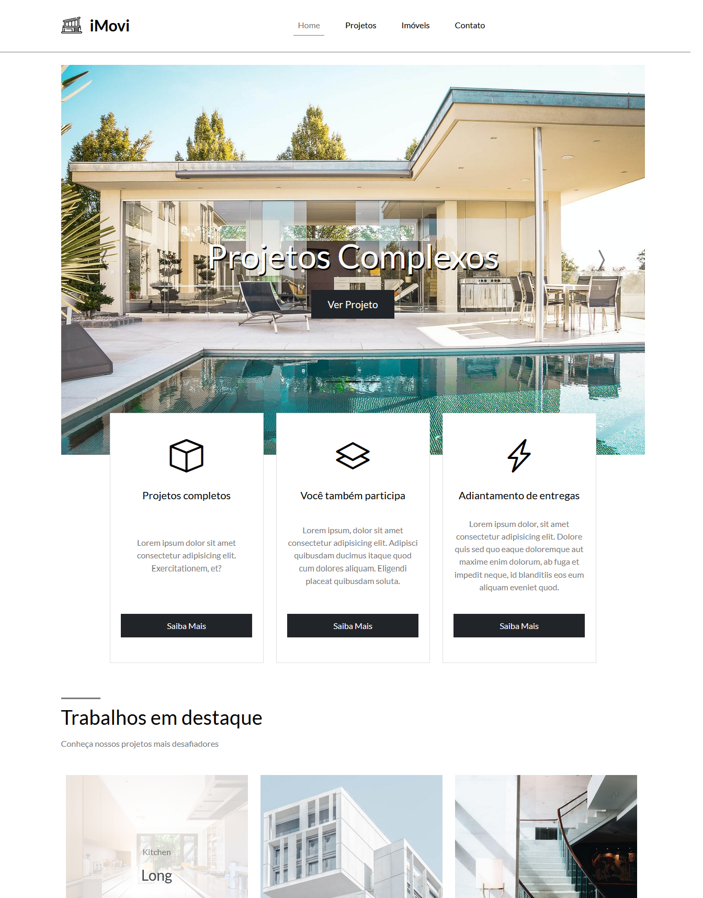

# <b>Hora de Codar - iMovi</b>

## <b>Visão Geral</b>
Projeto do curso de <b>Bootstrap 5</b>, onde aplicamos as estruturas essenciais de grid, classes e helpers do framework. Além de englobar os conceitos de estruturação, técnicas de CSS. 
Objetivo do projeto foi criar uma landing page responsiva para uma imobiliária fictícia, desenvolvida com as technologias <b>Bootstrap 5</b>  e <b>SASS</b>. 
Aula ministrada pelo meu amigo <b>Matheus Battisti</b>.
   

## <b>Screenshots</b>

_iMovi - Bootstrap 5_

  

   

## <b>Tecnologias / Ferramentas</b>
 &nbsp;
 &nbsp;
   

## <b>O Que Gostei de Aprender</b>
Os layouts / Design são muito bonitos, os exercícios são na medida do que foi aprendido e vai subindo a dificuldade gradualmente.
   

## <b>Ver Projeto Online</b>
 &nbsp;
   

## <b>Agradecimentos</b>
Agradecer ao meu amigo <b>[Matheus Battisti](https://www.rocketseat.com.br/)</b> pela oportunidade de aprender e práticar e desenvolver skills de Front-end.
   
