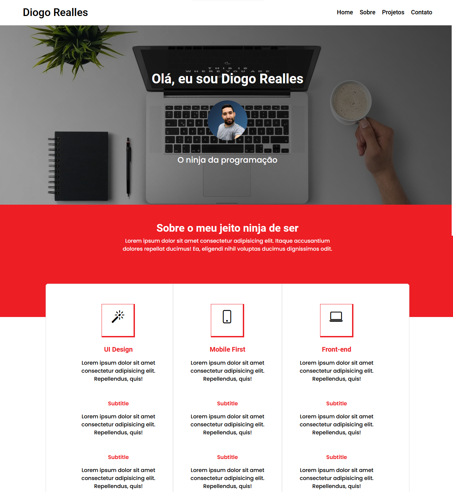

# <b>Hora de Codar - Porfólio</b>

## <b>Visão Geral</b>
Projeto do curso de <b>HTML</b>, onde aplicamos as estruturas essenciais de FLEXBOX, CLASSES e métodologia SMACSS para melhor organização de pastas. Além de englobar os conceitos de estruturação, técnicas de CSS / BEM. 
Objetivo do projeto foi criar um portfólio responsivo, desenvolvida com as technologias <b>HTML</b>, <b>CSS</b>, <b>JS</b> e <b>SASS</b>  e métodologia <b>BEM</b>. 
Aula ministrada pelo meu amigo <b>Matheus Battisti</b>.
   

## <b>Screenshots</b>

_Portfólio - HTML / CSS / JS / SASS / BEM_

   

## <b>Tecnologias / Ferramentas</b>
 &nbsp;
 &nbsp;
 &nbsp;
 &nbsp;
   

## <b>O Que Gostei de Aprender</b>
O layout / Design é muito bonito, os exercícios são na medida do que foi aprendido e vai subindo a dificuldade gradualmente.
   

## <b>Ver Projeto Online</b>
 &nbsp;
   

## <b>Agradecimentos</b>
Agradecer ao meu amigo <b>[Matheus Battisti](https://www.rocketseat.com.br/)</b> pela oportunidade de aprender e práticar e desenvolver skills de Front-end.
   
