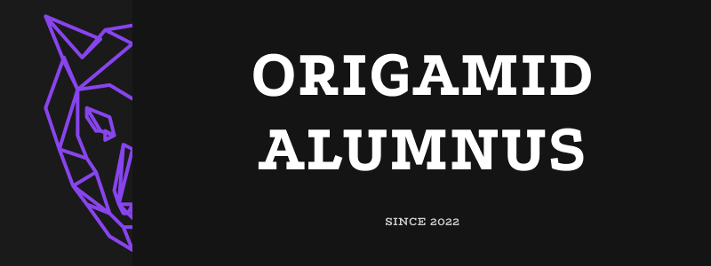

# <b>Origamid - Cursos e Projetos</b>
Repositório de diversos projetos desenvolvidos durante o curso na Origamid.
   

<table>
  <thead>
    <tr>
      <th>Curso</th>
      <th>Descrição</th>
      <th>Projetos</th>
    </tr>
  </thead>

  <tbody>
    <tr>
      <td>

      </td>
      <td>
        <b>[UI Design Para Iniciantes](https://github.com/DiogoRealles/courses/tree/develop/origamid/project01)</b> 
        Curso de UI Design para iniciantes, aborda desde o início até assuntos mais avançados como guias de design.
        Utilizamos a ferramenta <b>Figma</b> para desenvolver 2 layouts sendo o primeiro um <b>Portfólio</b> e o segundo o site <b>Bikcraft</b>.
      </td>
      <td>
        [Ver mais](https://github.com/DiogoRealles/courses/tree/develop/origamid/project01) 
      </td>
    </tr>
    <tr>
      <td>

      </td>
      <td>
        <b>[Front-end Para Iniciantes](https://github.com/DiogoRealles/courses/tree/develop/origamid/project02)</b> 
        Curso de Front-end para iniciantes, aborda desde os fundamentos até assuntos mais avançados e você poderá se atualizar/aprender uma abordagem diferente. Utilizamos tecnologias <b>HTML</b>, <b>CSS</b> e <b>JS</b> para desenvolver 2 layouts sendo o primeiro um <b>Portfólio</b> e o segundo o site <b>Bikcraft</b>.
      </td>
      <td>
        [Ver mais](https://github.com/DiogoRealles/courses/tree/develop/origamid/project02) 
      </td>
    </tr>
    <tr>
      <td>

      </td>
      <td>
        <b>[UI Design](https://github.com/DiogoRealles/courses/tree/develop/origamid/project03)</b> 
        Curso de Front-end e Web Design
      </td>
      <td>
        [Ver mais](https://github.com/DiogoRealles/courses/tree/develop/origamid/project03) 
      </td>
    </tr>
  </tebody>
</table>
