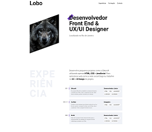
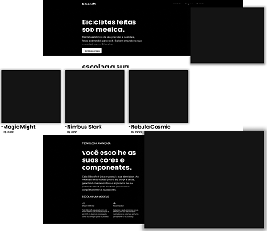

# <b>Origamid - Front-end Para Iniciantes</b>

## <b>Visão Geral</b>
Curso de Front-end para iniciantes, aborda desde os fundamentos até assuntos mais avançados e você poderá se atualizar/aprender uma abordagem diferente. Utilizamos tecnologias <b>HTML</b>, <b>CSS</b> e <b>JS</b> para desenvolver 2 layouts sendo o primeiro um <b>Portfólio</b> e o segundo o site <b>Bikcraft</b>.
   

## <b>Screenshots</b>

_Portfólio_

  

_Bikcraft_

   

## <b>Tecnologias / Ferramentas</b>
 &nbsp;
 &nbsp;
 &nbsp;
   

## <b>O Que Gostei de Aprender</b>
Gostei do truque com radio buttons utilizando somente CSS.
   

## <b>Ver Projeto Online</b>
 &nbsp;

 &nbsp;
   

## <b>Agradecimentos</b>
Agradecer a <b>[Origamid](https://www.origamid.com)</b> por disponibilizar esse conteúdo para poder práticar e desenvolver skills de Front-end.
   

