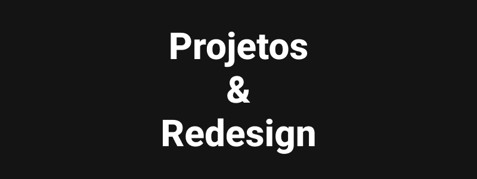

# <b>Projetos</b>
Repositório de diversos projetos desenvolvidos para estudos, práticas e/ou redesign.
   

<table>
  <thead>
    <tr>
      <th>Projeto</th>
      <th>Descrição</th>
      <th>Projetos</th>
    </tr>
  </thead>

  <tbody>
    <tr>
      <td>

      </td>
      <td>
        <b>[Anthem](https://github.com/DiogoRealles/courses/tree/develop/projects/project01)</b> 
        Projeto desenvolvido para praticar e desenvolver skills de CSS Flexbox, SASS, LP responsiva sem uso de media query. 
        Tecnologias utilizadas: <b>HTML</b>, <b>CSS (SASS / BEM / CSS FlexBox)</b> e <b>JS</b> 
      </td>
      <td>
        [Ver mais](https://github.com/DiogoRealles/courses/tree/develop/projects/project01) 
      </td>
    </tr>
    <tr>
      <td>

      </td>
      <td>
        <b>[Game Tabuada](https://github.com/DiogoRealles/courses/tree/develop/projects/project02)</b> 
        Game Tabuada desenvolvido com <b>HTML</b> <b>CSS</b> e <b>JS</b> 
        Projeto pode ser usado para gamification da tabuada, ajudando no aprendizado. 
        Conta com uma interface simples e intuitiva, constraste e acessibilidade..
      </td>
      <td>
        [Ver mais](https://github.com/DiogoRealles/courses/tree/develop/projects/project02) 
      </td>
    </tr>
  </tebody>
</table>
