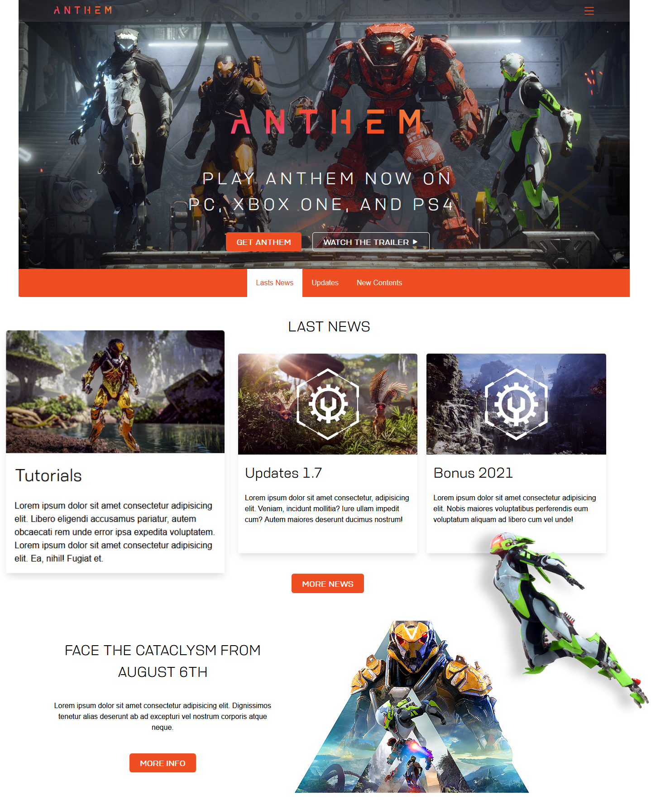

# <b>Anthem</b>

## <b>Visão Geral</b>
Site responsivo sem uso de <b>breakpoinst media query</b>. 
Extraindo o que de melhor o <b>CSS Flexbox</b> pode oferecer para dar mais performance ao projeto. 
<b>Outro diferencial</b> são os cards, possuem mesma altura, mantendo assim a consistência do layout. 
Projeto baseado em um dos sites da <b>EA Esports</b>.
   

## <b>Screenshots</b>

_Anthem_

   

## <b>Tecnologias / Ferramentas</b>
 &nbsp;
 &nbsp;
 &nbsp;
 &nbsp;
   

## <b>O Que Gostei de Aprender</b>
Com base nas dicas do [Tárcio Zemel](https://www.facebook.com/tarciozemel) de <b>CSS Flexbox</b> e sugerido por um conhecido muto bom em UI Design [Umberto Junior](https://www.facebook.com/umberto.junior.50) deu a ideia de fazer um site responsivo sem media query. 
Muito boa a experiência de elevar o poder do <b>CSS Flexbox</b> e <b>SASS com métodologia BEM</b>.
   

## <b>Ver Projeto Online</b>
 &nbsp;
   