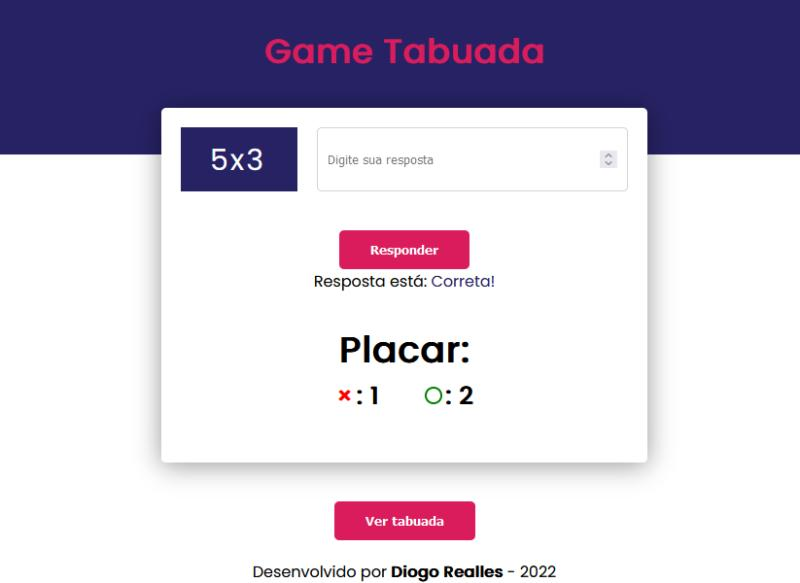

# <b>Game Multiplication</b>

## <b>Visão Geral</b>
Game Tabuada <b>HTML</b>, <b>CSS</b> e <b>JS</b> 
Projeto para praticar <b>JavaScript</b> 
Gera números aleatórios. 
Compara com o que o usuário digitou. 
Dar feedback (positivo ou negativo). 
Projeto pode ser usado para gamification da tabuada, ajudando no aprendizado. 
Conta com uma interface simples e intuitiva, constraste e acessibilidade.
   

## <b>Screenshots</b>

_Game Multiplication_

   

## <b>Tecnologias / Ferramentas</b>
 &nbsp;
 &nbsp;
 &nbsp;
 &nbsp;
   

## <b>O Que Gostei de Aprender</b>
Tenho muita satisfação desse projeto, pois foi um desafio aplicar os conceitos de JS em um projeto que fosse relevante e agradável.
   

## <b>Ver Projeto Online</b>
 &nbsp;
   
