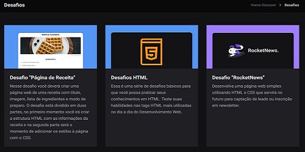

# <b>Rocketseat - Discover</b>

## <b>Visão Geral</b>
Formação completa para você dominar os fundamentos. 
Trilhe um caminho claro e sólido com mais de 500 aulas para você construir os alicerces necessários. 
Aulas ministradas pelos professores <b>Jakeliny Gracielly</b> e <b>Mayk Brito</b>.
   

## <b>Screenshots</b>

_Desafios_

   

## <b>Tecnologias / Ferramentas</b>
 &nbsp;
 &nbsp;
 &nbsp;
   

## <b>O Que Gostei de Aprender</b>
Os layouts / Design são muito bonitos, os exercícios são na medida do que foi aprendido e vai subindo a dificuldade gradualmente.
   

## <b>Ver Projeto Online</b>
 &nbsp;
   

## <b>Agradecimentos</b>
Agradecer a <b>[Rocketseat](https://www.rocketseat.com.br/)</b> por disponibilizar esse conteúdo para poder práticar e desenvolver skills de Front-end.
   

