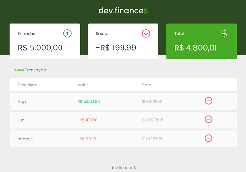
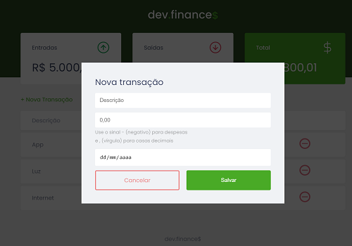

# <b>Rocketseat - DevFinances</b>

## <b>Visão Geral</b>
Mini sistema financeiro para controle de gastos e ganhos de forma organizada e simples desenvolvida com <b>HTML</b>, <b>CSS</b> e <b>JS</b>. Maratona prática com a mão no código para consolidar os conceitos aprendidos nas trilhas e cursos do <b>Discover</b>.
   

## <b>Screenshots</b>

_DevFinances_

  

_DevFinances_

   

## <b>Tecnologias / Ferramentas</b>
 &nbsp;
 &nbsp;
 &nbsp;
   

## <b>O Que Gostei de Aprender</b>
Layout/Design muito bonito, conteúdo sobre acessibilidade. 
Didáticas perfeitas dos instrutores <b>Jakeliny Gracielly</b> e <b>Mayk Brito</b>
   

## <b>Ver Projeto Online</b>
 &nbsp;
   

## <b>Agradecimentos</b>
Agradecer a <b>[Rocketseat](https://www.rocketseat.com.br/)</b> por disponibilizar esse conteúdo para poder práticar e desenvolver skills de Front-end.
   

